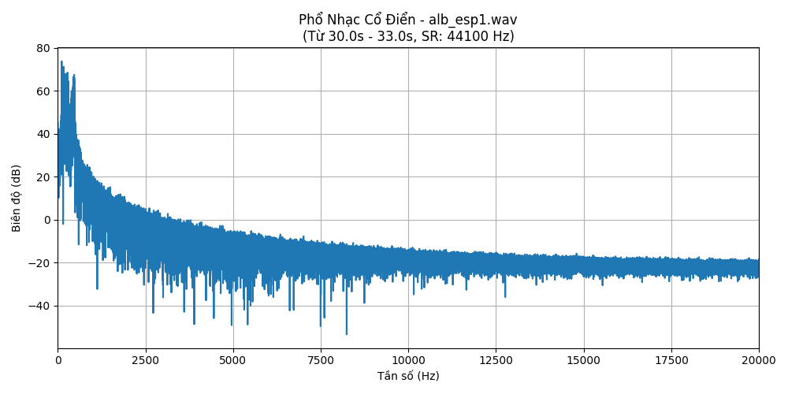
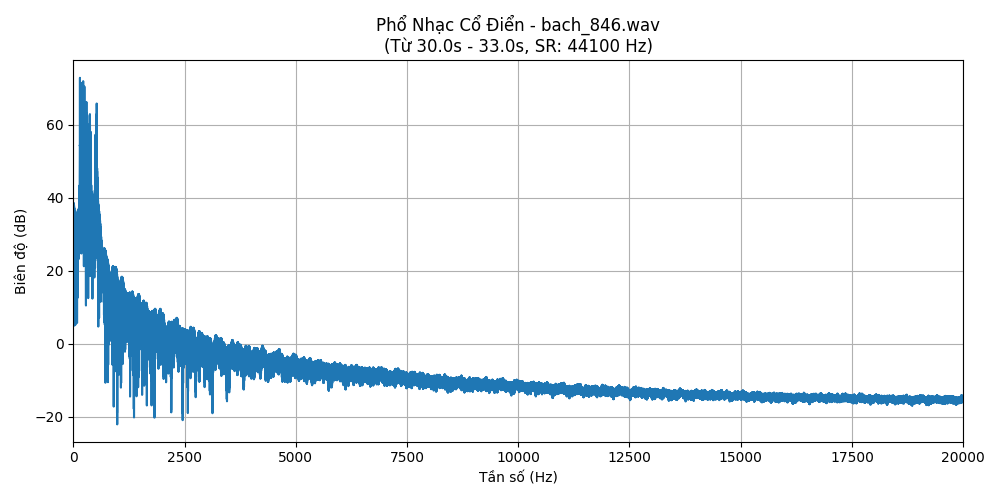
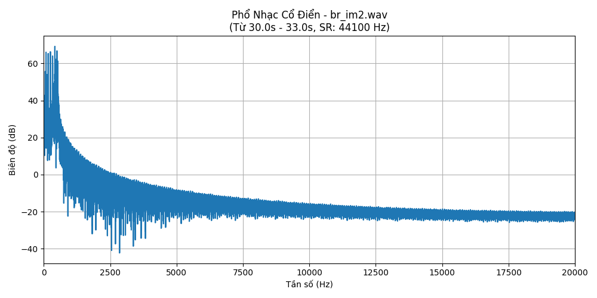
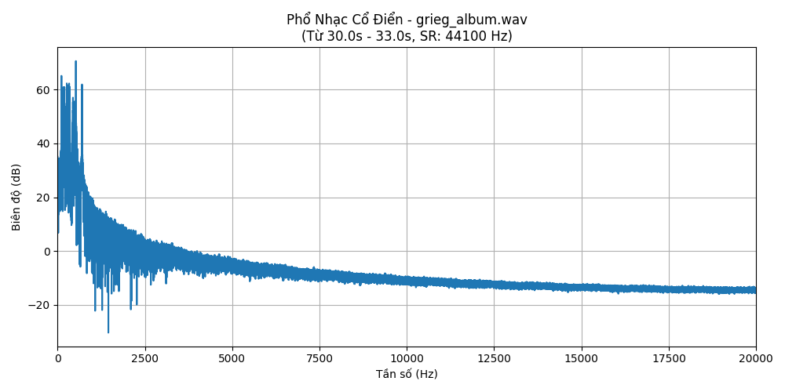
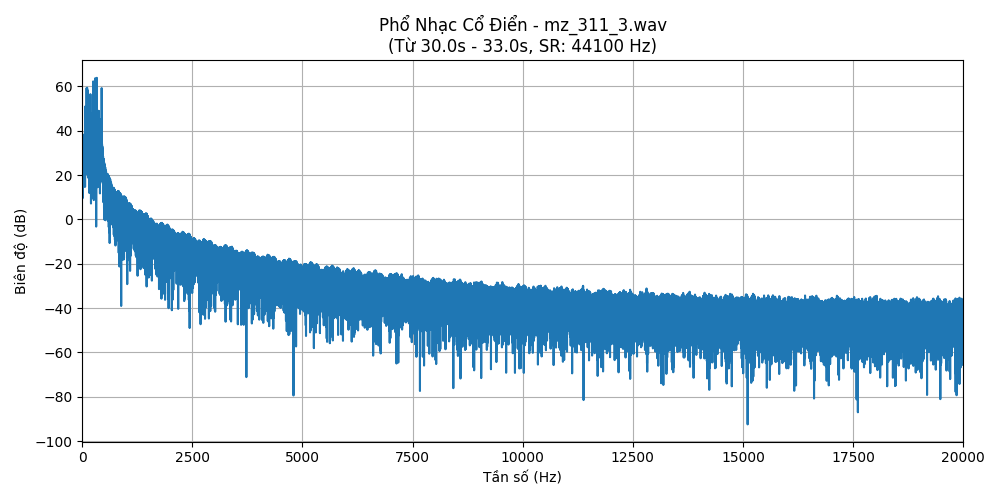
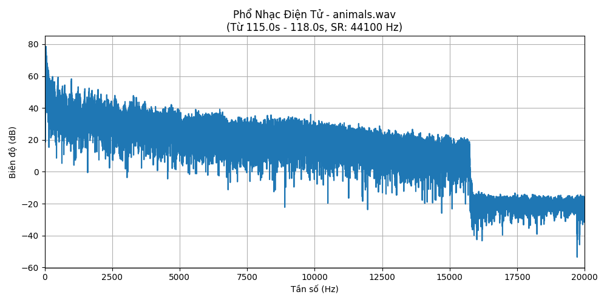
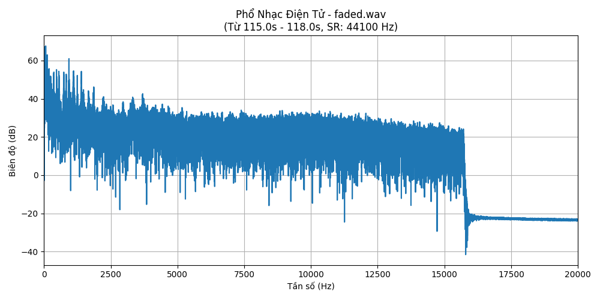
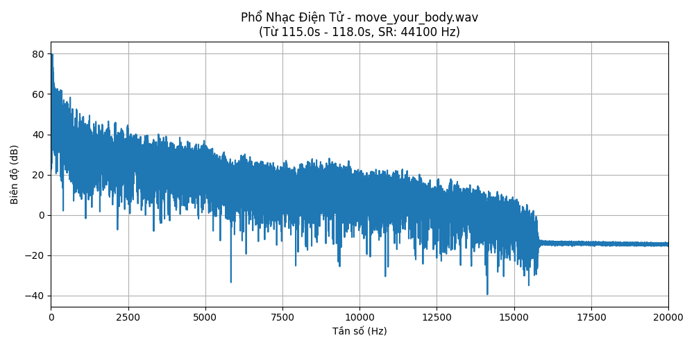
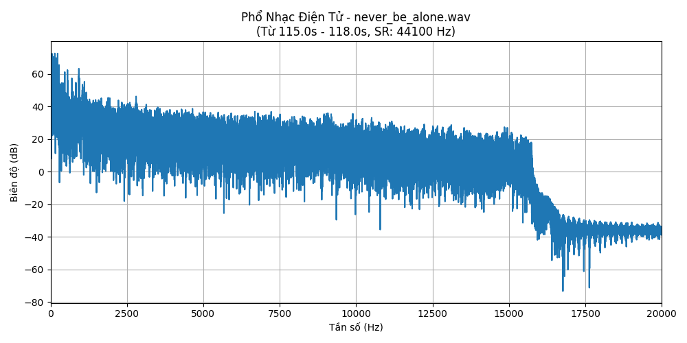
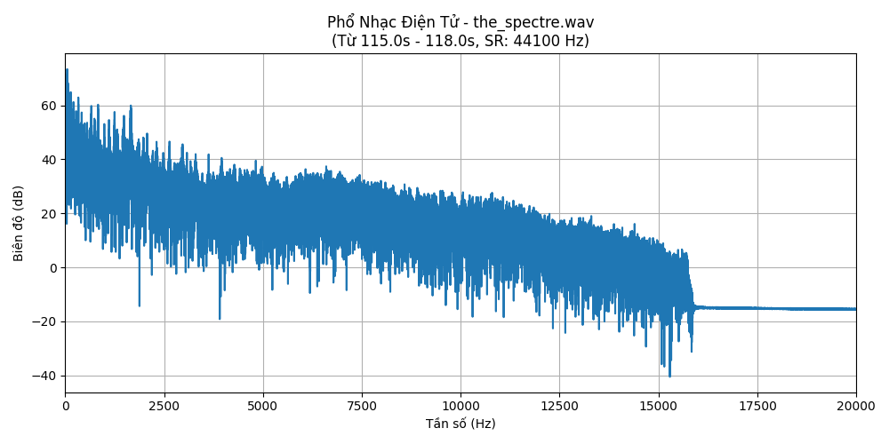

# So sánh phổ âm thanh giữa nhạc cổ điển và nhạc điện tử
# 0. Hướng dẫn chạy code
- Tải code về máy tính
```bash
git clone https://github.com/Lam-Hung-ai/TH4
```
- Cài đặt thư viện
```python
pip install -r requirement.txt
```
- Chạy toàn bộ block code trong file [main.ipynb](./main.ipynb)
# 1. Giới thiệu

Nhạc luôn là món ăn tinh thần chung của con người hàng ngàn năm nay và là điều không thể thiếu trong mọi thời đại. Tuy nhiên con người luôn luôn thay đổi dẫn đến những xu hướng về âm nhạc cũng thay đổi theo. Để làm rõ điều này hôm nay tôi sẽ thực hiện phân tích phổ nhạc cổ điển và hiện đại qua trực quan ảnh phổ nhạc bằng phương pháp FFT (Fast Fourier Transform).

FFT (Fast Fourier Transform) là một thuật toán số học được dùng để tính toán Biến đổi Fourier rời rạc (DFT) và nghịch đảo DFT (IDFT) một cách nhanh chóng và hiệu quả. Nó giúp tách một âm thanh phức tạp thành nhiều âm thanh nhỏ, mỗi cái có một tần số riêng. Từ đó có thể lấy dữ liệu về tần số và biên độ của âm thanh để trực quan phổ nhạc.

Code tham khảo: [Github\_repo](https://github.com/Lam-Hung-ai/TH4)

# 2. Bộ dữ liệu

Với nhạc cổ điển, tôi sẽ lấy dữ liệu từ Kaggle \[[Nhạc cổ điển](https://www.kaggle.com/datasets/soumikrakshit/classical-music-midi)\] - nền tảng hàng đầu cho các nhà khoa học dữ liệu và chuyên gia học máy, cung cấp rất tập dữ liệu. Bộ dữ liệu này gồm rất nhiều tập tin âm nhạc cổ điển dưới dạng “.mid” nhưng trong bài báo cáo này tôi sẽ dùng 5 bài hát: alb\_esp1, bach\_846, mz\_311\_3, grieg\_album, br\_im2

Với nhạc điện tử tôi cũng thu thập 5 bài hát phổ biến trên mạng xã hội để phân tích đánh giá bao gồm: Animals, Faded, Move your body, Never be alone, The spectre

# 3. Kết quả

Sau khi thực hiện FFT để lấy biên độ và tần số âm nhạc thì tôi đạt được các biểu đồ phổ nhạc như sau:

- Nhạc cổ điển

  
  
  
  
  

- Nhạc điện tử

  
  
  
  
  

# 4. Phân tích đánh giá

a) Đối với nhạc cổ điển:

- Các biểu đồ phổ nhạc cổ điển đều cho thấy năng lượng âm thanh tập trung chủ yếu ở dải tần số từ thấp đến trung bình (thường dưới 2500 Hz), nơi chứa các nốt nhạc cơ bản và hài âm chính.
- Cấu trúc phổ rất dày đặc với nhiều đỉnh nhọn gần nhau, minh chứng cho sự phong phú của các hài âm tự nhiên từ các nhạc cụ acoustic.
- Biên độ âm thanh giảm dần một cách tự nhiên và mượt mà ở các tần số cao, không có hiện tượng bị cắt đột ngột.
- Mặc dù có sự hiện diện của tần số thấp, nhưng không có các đỉnh năng lượng sub-bass cực mạnh và tách biệt như thường thấy trong nhạc điện tử.
- Tổng thể, các phổ này thể hiện một "dấu ấn" âm học nhất quán, đặc trưng cho âm thanh phức tạp và giàu nhạc tính của dàn nhạc cổ điển.

b) Đối với nhạc điện tử:

- Năng lượng âm thanh của nhạc điện tử tập trung rất mạnh mẽ ở dải tần số cực thấp và thấp , tạo nên nhịp điệu và sự "nặng đô" đặc trưng.
- Phổ tần ở dải trung thường rất "dày đặc" và "đầy đặn", phản ánh sự phức tạp của các lớp âm thanh tổng hợp và hiệu ứng.
- Một đặc điểm nổi bật và nhất quán là sự cắt giảm tần số rất đột ngột và rõ ràng ở khoảng 15-16 kHz.
- Trước điểm cắt này, dải tần số cao vẫn duy trì năng lượng đáng kể, tạo nên sự "sáng" và "sắc nét" thường thấy trong thể loại này.
- Các đặc điểm như bass mạnh, phổ dày và điểm cắt tần số cao thể hiện sự đồng nhất, phản ánh các kỹ thuật sản xuất và xử lý âm thanh phổ biến trong nhạc điện tử hiện đại.

c) Điểm chung của 2 biểu đồ nhạc

- Cả hai thể loại đều sử dụng một dải tần số rộng mà tai người có thể nghe được, bao gồm các tần số từ thấp đến cao.
- Cả hai đều cho thấy phổ âm thanh phức tạp với nhiều thành phần tần số, không phải là các âm đơn giản, phản ánh sự đa dạng của nguồn âm (nhạc cụ trong nhạc cổ điển, âm thanh tổng hợp và nhiều lớp trong nhạc điện tử).

d) Sự khác nhau giữa 2 biểu đồ nhạc

Năng Lượng Tần Số Thấp (Bass):

- Nhạc Điện Tử: Có năng lượng ở dải tần số cực thấp (sub-bass) và thấp (bass) vượt trội, mạnh mẽ và thường là yếu tố chủ đạo.
- Nhạc Cổ Điển: Có tần số thấp nhưng thường ở mức độ vừa phải, tự nhiên từ các nhạc cụ acoustic, không nhấn mạnh và mạnh mẽ như nhạc điện tử.

Đặc Điểm Tần Số Cao (Treble):

- Nhạc Điện Tử: Thường có năng lượng tần số cao duy trì ở mức đáng kể cho đến một điểm bị cắt giảm rất đột ngột và rõ ràng (thường quanh 15-16 kHz trong các ví dụ đã xem).
- Nhạc Cổ Điển: Có sự suy giảm năng lượng ở tần số cao một cách tự nhiên và từ từ, không có điểm cắt đột ngột.

Kết Cấu và Màu Sắc Âm Thanh (Timbre/Texture):

- Nhạc Điện Tử: Phổ thường "dày đặc", "ồn ào" hơn, phản ánh các lớp âm thanh tổng hợp, hiệu ứng và các yếu tố nhịp điệu được xử lý kỹ thuật số.
- Nhạc Cổ Điển: Phổ thường cho thấy các cấu trúc hài âm rõ ràng hơn từ các nhạc cụ acoustic, tạo cảm giác "tự nhiên" và "trong sáng" hơn.

Sự Cân Bằng và Xử Lý Tổng Thể:

- Nhạc Điện Tử: Phổ thường có vẻ "đầy đặn" hơn trên toàn dải (cho đến điểm cắt), có thể phản ánh việc sử dụng nhiều kỹ thuật nén (compression) và xử lý để tối đa hóa âm lượng và tác động.
- Nhạc Cổ Điển: Phổ thường có sự cân bằng tự nhiên hơn giữa các dải tần, với dải động (dynamic range) có thể rộng hơn trong một bản ghi chất lượng cao chưa qua nhiều xử lý nén.

# 5. Kết luận

Phổ âm thanh của nhạc cổ điển và nhạc điện tử thể hiện những "dấu ấn" rất khác biệt: nhạc cổ điển nổi bật với sự tự nhiên của hài âm từ nhạc cụ acoustic và dải tần cân bằng; trong khi nhạc điện tử được định hình bởi năng lượng bass mạnh mẽ, kết cấu âm thanh tổng hợp dày đặc và thường có dấu hiệu xử lý kỹ thuật số rõ rệt ở tần số cao. Sự khác biệt này phản ánh rõ ràng nguồn gốc âm thanh, kỹ thuật sản xuất và mục đích nghệ thuật riêng của mỗi thể loại.